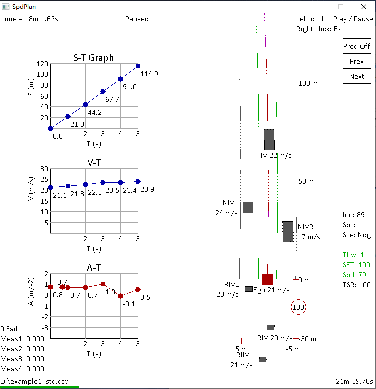
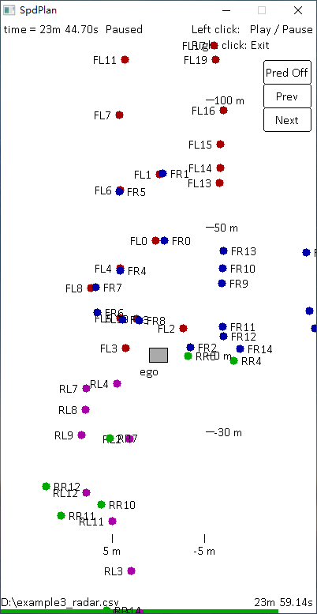

# Autonomous Driving Visualization Tool
- [English](#english)
- [中文](#中文)
- [Français](#français)

        

## English
### Discription
This tool, specifically designed and implemented in autonomous driving domain, enables you to replay logs in the **(.csv)** format  
If equipped with speed planning source code, it could be utilized not only for data loopback but also for local simulation  
In standard mode, the following display information is currently supported by default:
1. Obstacles (position, speed, heading, prediction trajactory)
2. Lane lines (left, right, next left, next right, virtual center line, lane change guide line)
3. Speed planning results (S-T, V-T, A-T graphs)
4. Ego motion status (set/actual speed, ACC mode)
5. TSR info (speed limit sign, special sign, ego display/alert status)
### Usage Instructions
- Multi-mode data visualization is supported. Precompiled executable files **.exe** are provided in the ` /dist/ ` directory, no need to recompile from source code
- Four default modes are included: 1. Speed Planning ` SpdPlan.exe `; 2. AGSM Centerline ` Agsm.exe `; 3. Radar Points ` Radar.exe `; 4. ME Raw Objects ` MeObj.exe `
- Download all files from the ` /dist/ ` directory (` libgcc_s_seh-1.dll ` and ` libstdc++-6.dll ` are compulsory)
- Double-click on the executable file to open it. In the pop-up window, select the **.csv** log you want to play. For example, open ` SpdPlan.exe ` and select ` example1_SpdPlan.csv ` to play the data 
- Optionally, to adjust the display effect in each mode, it is recommended to download the entire project source code and activate the corresponding macro switches (AGSM / RADAR / MEOBJ) in CMakeLists.txt to switch the display mode, and then recompile the executable file
- Additionally, the **.csv** logs compatible with each mode must be exported by ASAMMDF software. For instance, in the "Data Export" page of ASAMMDF, load ` SpdPlan_signals.lab `, so that the **.csv** exported by **.mf4** files can be normally played by ` SpdPlan.exe `
### Compilation Requirements
* Platform: Windows (Linux not supported due to incompatiblity of EasyX)
* Language: C++
* MinGW: To compile executable file (.exe), an environment installed MinGW is strictly required. [MinGW official download site](https://github.com/niXman/mingw-builds-binaries/releases/tag/13.2.0-rt_v11-rev1)
* CMake: To build and package this project, it is recommended to install CMake tool. [CMake official download site](https://cmake.org/download/)
* EasyX: For compiling the program with source code, the installlation of EasyX is essential. [EasyX official download site](https://codebus.cn/bestans/easyx-for-mingw)
### Note
* ASAMMDF is an open-source MDF offline data analysis software, which can convert mf4 files into csv format. [ASAMMDF official download site](https://github.com/danielhrisca/asammdf)

## 中文
### 概要
该工具适用于自动驾驶行业，功能是可视化 **(.csv)** 格式的日志  
若配合速度规划源码，可额外激活数据回灌和本地仿真功能  
标准模式下，默认支持以下信息显示：
1. 障碍物 （位置、速度、航向角、预测轨迹）
2. 车道线 （左、右、左左、右右，中心虚拟线，变道引导线）
3. 速度规划结果 （S-T, V-T, A-T 图）
4. 自车运动状态 （设置/当前 速度, 自适应巡航模式）
5. 交通标志识别信息 （限速标识、特殊标识、自车显示、报警状态）
### 使用方式
- 本工具支持多类型数据显示，已提供编译完成的可执行文件 **.exe** ，无需源码重新编译，见` /dist/ `
- 默认提供四种模式的程序：1. 速度规划` SpdPlan.exe `；2. AGSM中心线` Agsm.exe `；3. 雷达点` Radar.exe `；4. ME原始目标` MeObj.exe `
- 下载 ` /dist/ ` 路径下的所有文件（必须包括` libgcc_s_seh-1.dll ` 和 ` libstdc++-6.dll `）
- 双击打开某模式的可执行文件。弹框中选择相应 **.csv** 格式的日志以播放。以速度规划为例，打开` SpdPlan.exe `，并选择` example1_SpdPlan.csv `，即可播放数据
- 可选地，如需调整各模式下的显示效果，须完整下载本工程所有源码，并在 CMakeLists.txt 中激活相应的宏开关(AGSM / RADAR / MEOBJ)，以切换显示模式，并重新编译可执行文件
- 特别地，各模式适配的 **.csv** 日志，须由ASAMMDF软件加载对应模式的 **.lab** 配置文件导出。例如，在ASAMMDF的“数据导出”一页中，加载 ` SpdPlan_signals.lab ` ，如此 **.mf4** 文件导出的 **.csv** 才可被` SpdPlan.exe `正常播放。
### 编译要求
* 平台: Windows (Linux不兼容EasyX)
* 语言: C++
* MinGW: 运行可执行文件 (.exe)，推荐安装MinGW编译器. [MinGW官方下载](https://github.com/niXman/mingw-builds-binaries/releases/tag/13.2.0-rt_v11-rev1)
* CMake: 构建、打包本项目，推荐安装CMake工具. [CMake官方下载](https://cmake.org/download/)
* EasyX: 编译源码，还需额外安装EasyX库. [EasyX官方下载](https://codebus.cn/bestans/easyx-for-mingw)
### 附注
* ASAMMDF是一款开源的MDF离线数据分析软件，可将mf4文件转化为csv格式。[ASAMMDF官方地址](https://github.com/danielhrisca/asammdf)

## Français
### Description
Cet outil, spécialement conçu et implémenté dans le domaine de la conduite autonome, vous permet de rejouer les journaux au format **(.csv)**
S’il est équipé d’un code source de planification de vitesse, il pourrait être utilisé non seulement pour le bouclage de données, mais aussi pour la simulation locale  
En mode standard, les informations d’affichage suivantes sont actuellement prises en charge par défault :
1. Obstacles (position, vitesse, cap, trajectoire de prédiction)
2. Lignes de voie (gauche, droite, prochaine gauche, prochaine droite, ligne virtuelle centrale, ligne de guidage de changement de voie)
3. Résultats de la planification de vitesse (graphiques S-T, V-T, A-T)
4. État du mouvement de l’ego (vitesse réglée/réelle, mode ACC)
5. Infos TSR (panneau de limitation de vitesse, panneau spécial, affichage de l’ego/état d’alerte)
### Instructions d'utilisation
- La visualisation de données multi-types est prise en charge. Les fichiers exécutables **.exe** sont fournis dans le répertoire ` /dist/ `, pas besoin de recompiler à partir du code source
- Les quatre modes par défaut sont inclus : 1. Planification de vitesse ` SpdPlan.exe `; 2. AGSM Centreline ` Agsm.exe `; 3. Points Radar ` Radar.exe `; 4. Objets ME Raw ` MeObj.exe `
- Télécharger tous les fichiers du Répertoire ` /dist/ ` (` libgcc_s_seh-1.dll ` et ` libstdc++-6.dll ` sont requis)
- Double-cliquez sur le fichier exécutable pour l'ouvrir. Dans la fenêtre contextuelle, sélectionnez le journal au format **.csv** que vous souhaitez lire. Par exemple, ouvrez ` SpdPlan.exe ` et sélectionnez ` example1_SpdPlan.csv ` pour lire les données
- Ouvrez le fichier exécutable ` spdplan.exe `. Dans la fenêtre contextuelle, sélectionnez le Journal au format **.csv** que vous souhaitez lire
- Facultativement, pour ajuster l'effet d'affichage dans chaque mode, il est recommandé de télécharger le code source complet et d'activer les macros correspondantes (AGSM / RADAR / MEOBJ) dans CMakeLists.txt pour changer le mode d'affichage, puis de recompiler le fichier exécutable
- En plus, les journaux **.csv** compatibles avec chaque mode doivent être exportés par le logiciel ASAMMDF. Par exemple, dans la page "Exportation de données" de ASAMMDF, chargez ` SpdPlan_signals.lab `, de sorte que les **.csv** exportés par **.mf4** soient correctement lus par ` SpdPlan.exe `
### Exigences de compilation
* Plate-forme : Windows (Linux non pris en charge en raison de l’incompatibilité d’EasyX)
* Langage : C++
* MinGW : Pour exécuter un fichier exécutable (.exe), un environnement installé MinGW est strictement requis. [Site de téléchargement officiel de MinGW](https://github.com/niXman/mingw-builds-binaries/releases/tag/13.2.0-rt_v11-rev1)
* CMake: Pour construire et empaqueter ce projet, il est recommandé d'installer l'outil cmake. [Site de téléchargement officiel de CMake](https://cmake.org/download/)
* EasyX : Pour compiler le programme avec le code source, l’installation d’EasyX est indispensable. [Site de téléchargement officiel d’EasyX](https://codebus.cn/bestans/easyx-for-mingw)
### Note
* ASAMMDF est un logiciel open source d'analyse de données MDF hors ligne, qui peut convertir les fichers mf4 au format csv. [Site de téléchargement officiel d’ASAMMDF](https://github.com/danielhrisca/asammdf)
